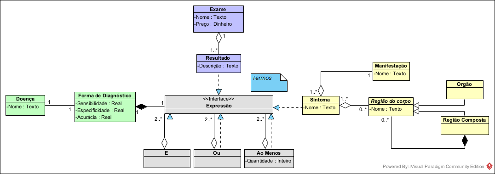
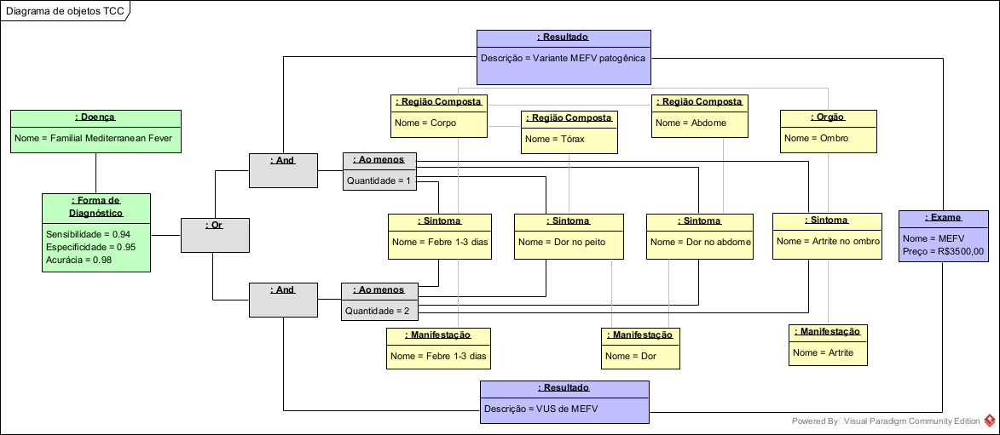

# DiseaseDx: Disease Diagnosis
Developed for my final project in Computer Science

---

## Setting up local environment

```bash
# Check for pipenv
$ pip show pipenv

# Install pipenv if not installed
$ pip install pipenv

# Install dependencies from Pipfile
$ pipenv install
```

You can run the `joined_inheritance.py` locally in 3 ways:
- Creating a MySQL database called `diseasedx_test` and saving the user and pass on `MYSQL_USER` and `MYSQL_PASS`
- Uncomment the `connection_string` to create a `local SQLite db` (and comment the other `connection_string`)
- Uncomment the `connection_string` to create a `SQLite db in memory` (and comment the other `connection_string`)

---

## Class Diagram



## Object Diagram

